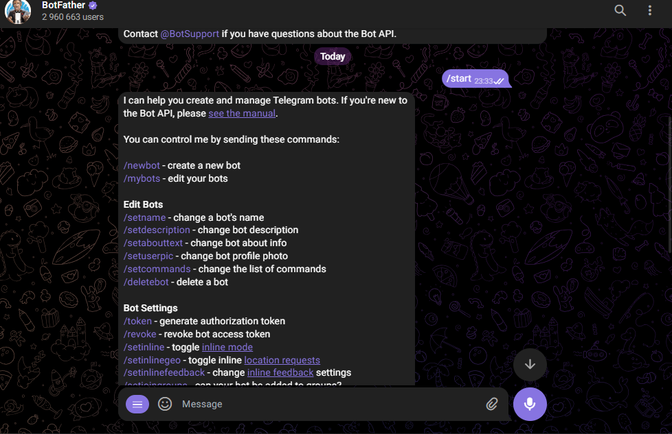
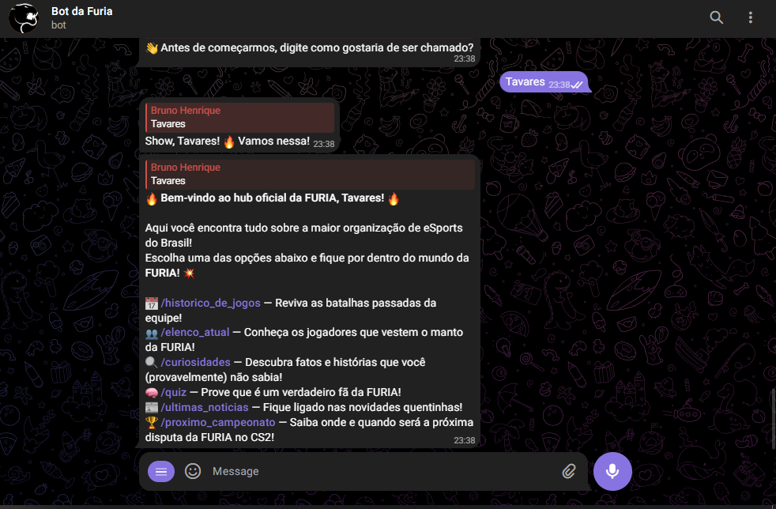
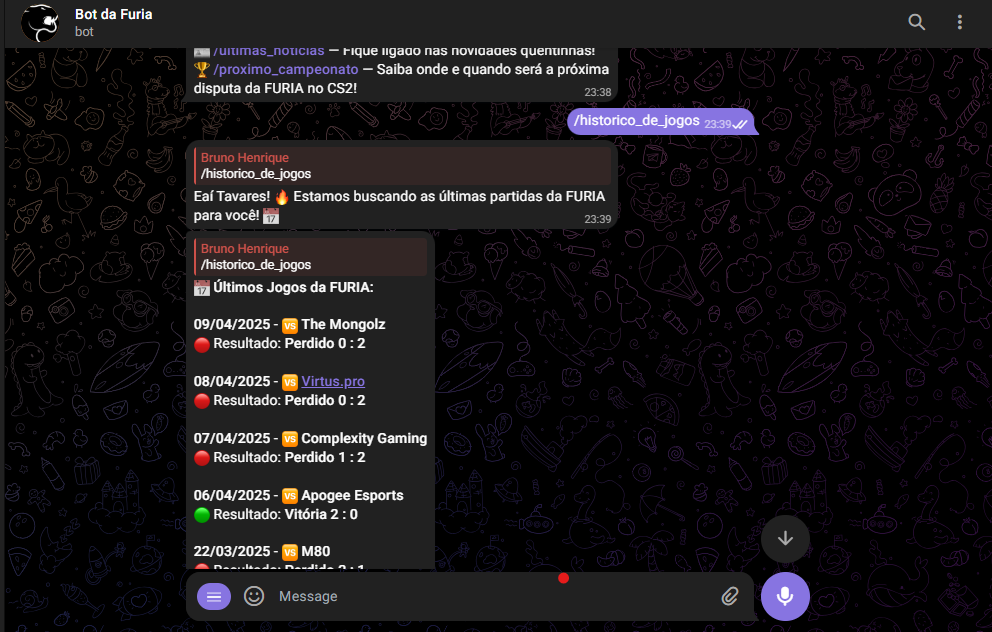
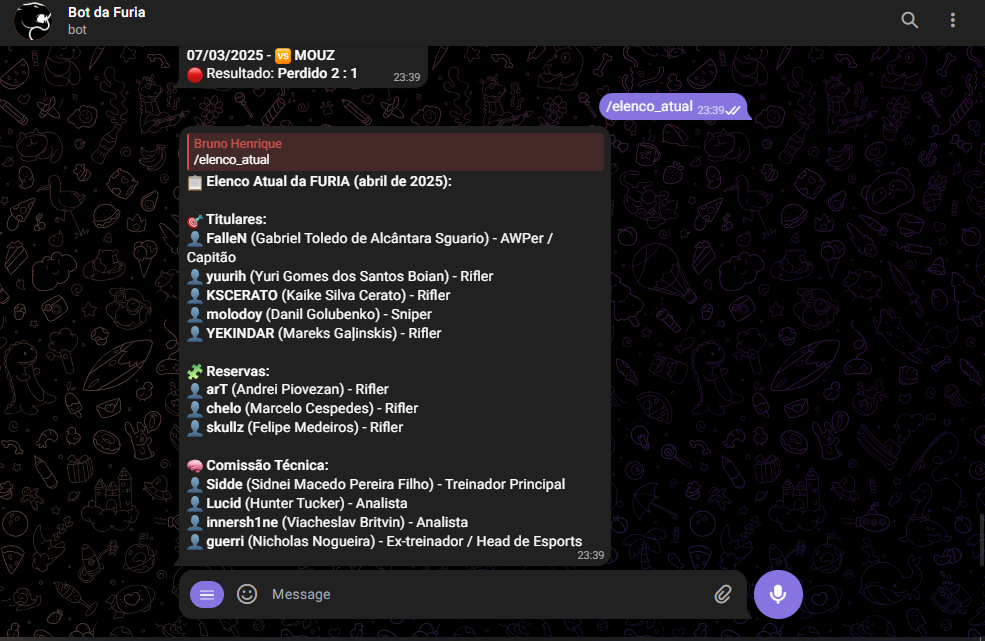
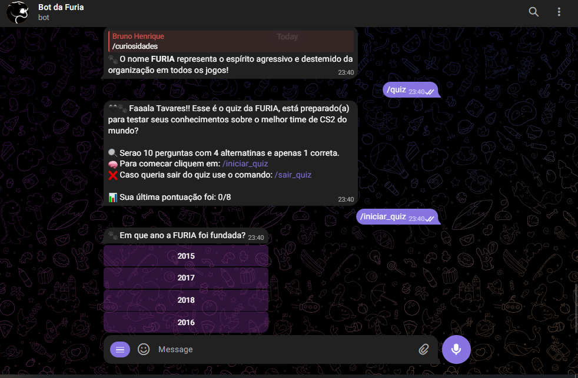
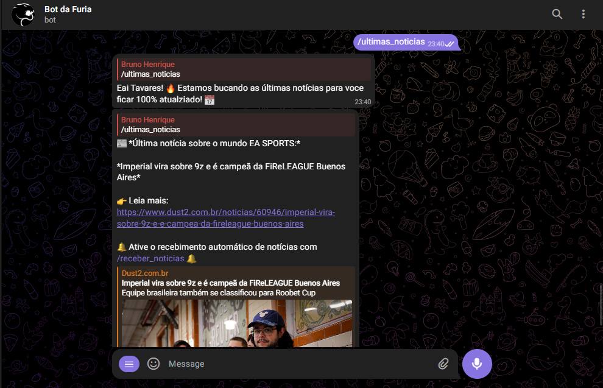
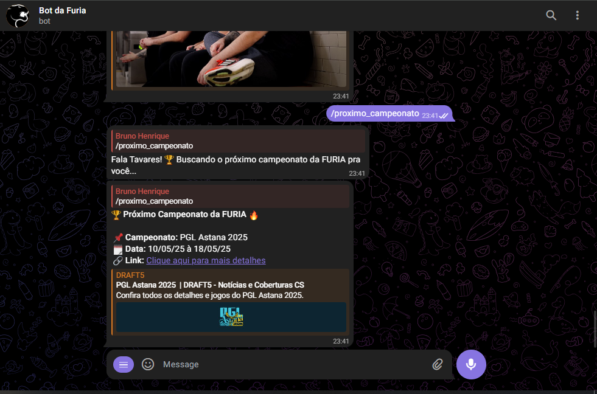

# 🐾 FuriaBot – Bot Oficial da FURIA Esports no Telegram

FuriaBot é um bot interativo desenvolvido em Python para a plataforma Telegram, com o objetivo de engajar fãs da FURIA Esports. Ele oferece quizzes, curiosidades, notificações de notícias e informações sobre o elenco e histórico do time.

---

## 🚀 Funcionalidades

- 🎮 **Quiz Interativo**: Teste seus conhecimentos sobre a FURIA com quizzes de múltipla escolha.
- 📰 **Notificações de Notícias**: Receba atualizações sobre partidas, resultados e novidades do time.
- 📚 **Curiosidades**: Descubra fatos interessantes sobre a história e os jogadores da FURIA.
- 👥 **Informações do Elenco**: Acesse detalhes sobre os jogadores atuais e passados.
- 📈 **Histórico de Partidas**: Consulte o desempenho do time em competições anteriores.

---

## 🛠️ Tecnologias Utilizadas

- [Python 3](https://www.python.org/)
- [pyTelegramBotAPI](https://pypi.org/project/pyTelegramBotAPI/)
- [python-dotenv](https://pypi.org/project/python-dotenv/)
- JSON para armazenamento de dados

---

## ⚙️ Como Executar o Projeto

### 1. Clone o repositório:

```bash
git clone https://github.com/matheustavares1/FuriaBot.git
cd FuriaBot
```
### 2. Baixe as dependências:
```
pip install -r requirements.txt
```
### 3. Configure o token do Bot:
Crie um arquivo .env na raiz do projeto com o seguinte conteúdo:
```
TELEGRAM_BOT_TOKEN=seu_token_aqui
```
### 4. Execute o bot:
```
python BotFuriaMain.py
```

### 🔧 Pré-requisitos

- Python 3.10 ou superior
- Git
- Conta no [Telegram](https://web.telegram.org)
- Um bot criado via [BotFather](https://t.me/BotFather) (para gerar seu token)


## Conseguindo o Token do Telegram:

### 1. Entre no Telegram e busque por BotFather:
<p align="center">
  
</p>

### 2. Use o comando /start e /newbot:
<p align="center">
  
</p>

## 🧪 Comandos Disponíveis

```bash
/start           # Inicia a interação com o bot
/iniciar_quiz    # Começa o quiz sobre a FURIA
/sair_quiz       # Encerra o quiz atual
/curiosidades    # Exibe curiosidades sobre o time
/elenco_atual         # Mostra informações sobre os jogadores
/historico_de_jogos       # Apresenta o histórico de partidas
```

### 1. /start - 🖤🐾 Seja muito bem-vindo(a), Furioso(a)!
<p align="center">
  
</p>

### 2. /historico_de_jogos -  📈 Confira os resultados recentes do time em campeonatos e torneios oficiais.
<p align="center">
  
</p>

### 3. /elenco_atual - 👥 Veja quem são os jogadores atuais que representam a FURIA no cenário competitivo.
<p align="center">
  
</p>

### 4. /quiz - 🧠 Responda 10 perguntas sobre a FURIA e veja sua pontuação final. O bot ainda salva sua pontuação anterior, incentivando a evolução
<p align="center">
  
</p>

### 5. /ultimas_noticias - 📰 Receba as notícias mais recentes sobre a FURIA, incluindo anúncios oficiais, resultados e mudanças no elenco.
<p align="center">
  
</p>

### 6. /proximo_campeonato - 🏆 Saiba qual será o próximo campeonato que a FURIA irá disputar, com data e nome do torneio.
<p align="center">
  
</p>


